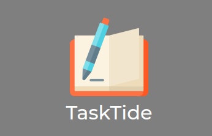
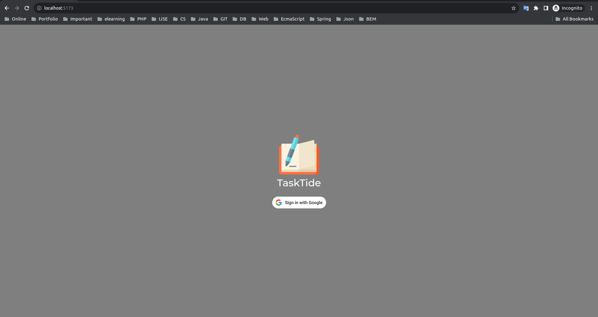
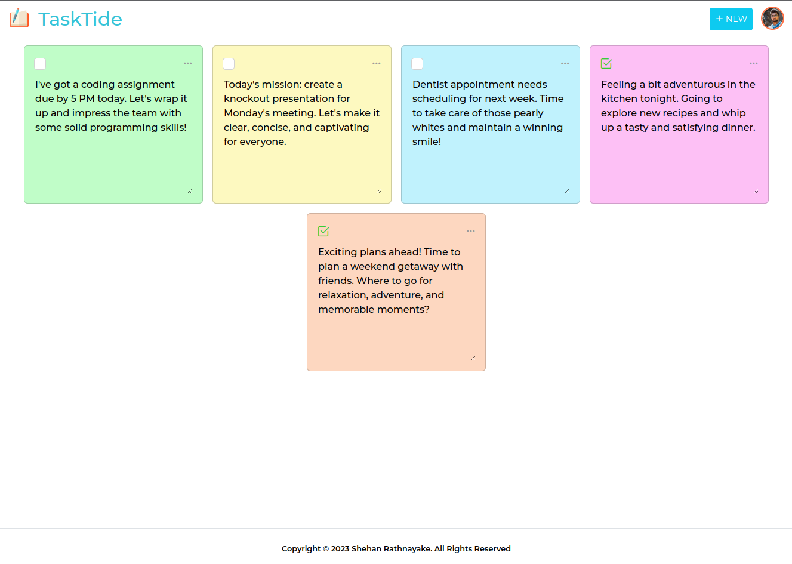
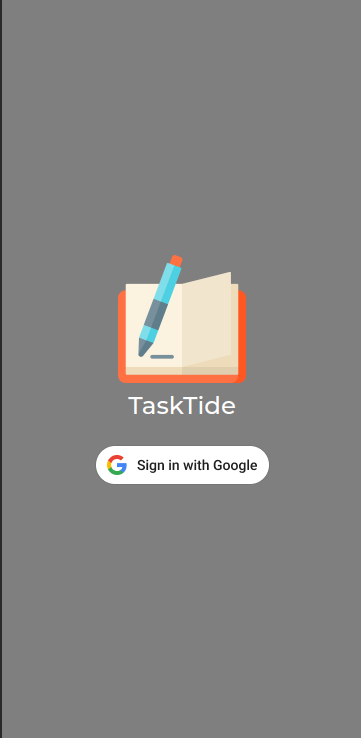
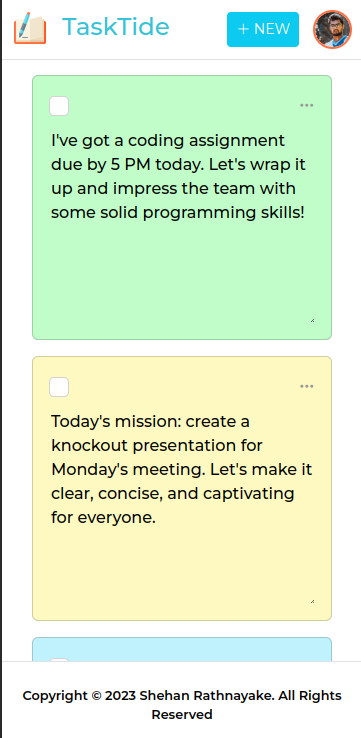

# TaskTide To Do App

### Version
1.0.0

### License
Copyright &copy; 2023 Shehan Rathnayake. All Rights Reserved. 
This project is licensed under [MIT License](License.txt).

## Introduction

Welcome to TaskTide, a sophisticated Todo Web App built using React for the front end and Java Spring for the backend. This front-end application focuses on providing an enhanced user experience through visually appealing interfaces, color-coded todo items, and a responsive design.

## Key Features

- **Color Changes** - TaskTide stands out with its dynamic color-changing todo items, allowing users to personalize and categorize tasks effortlessly.

- **Visually Better View** - Enjoy a visually pleasing and intuitive interface, designed to enhance task management and productivity.

- **Responsive Design** - TaskTide is crafted with a responsive design, ensuring a seamless experience across various devices and screen sizes.

- **Firebase Integration** - Hosted on Firebase, TaskTide leverages Google Authentication for secure user logins, ensuring a reliable and scalable solution.

## Tech Stack Used

- **Front End** - React
- **Back End** - Java Spring Framework
- **Database** - PostgreSQL
- **Hosting and Authentication** - Firebase

## Supported Links

- [Hosted Website URL on Firebase](https://to-do-app-13ecd.web.app/) 👈

## Sample Images

 

 

### Support

***If you like what I do, maybe consider buying me a coffee*** 🥺 👇

  
